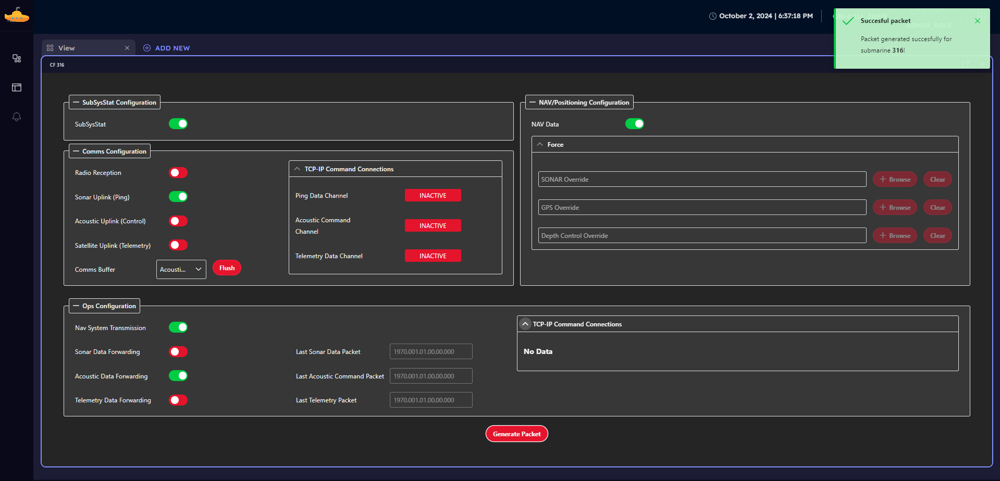
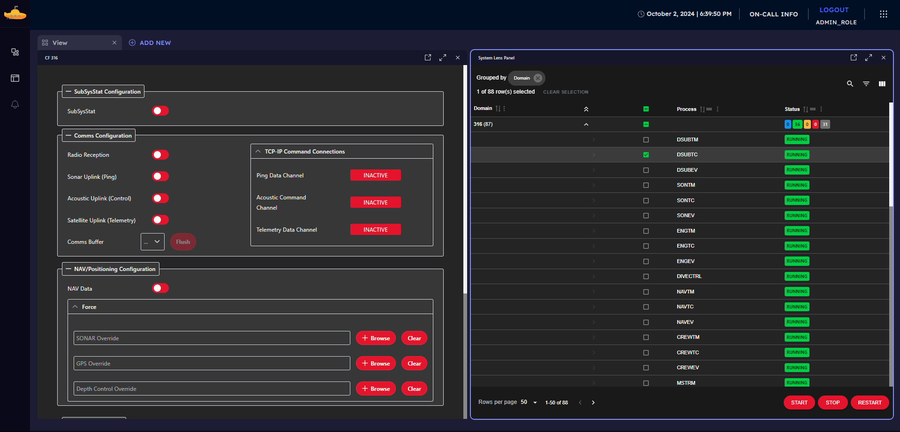
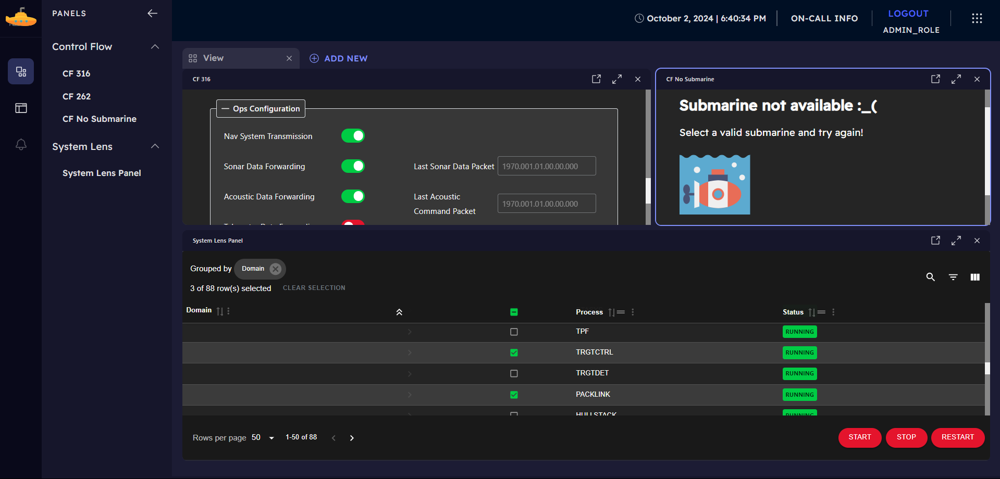

# 🌊 Corelink Submarine Tracking System
🌊 Corelink is an advanced maritime platform built to monitor and manage submarine operations. Built on a React-based Turborepo monorepo architecture, it dynamically loads microfrontends to provide real-time updates from various submarine systems. This highly flexible platform allows new components to be added easily through a dynamic federation setup.

## 🚀 Getting Started
To get started with Corelink, follow these simple steps:

1. Clone the repository.
2. Run the following command in the root directory:
```sh
npm install
```
3. Once dependencies are installed, launch the project with:
```sh
npm start
```
That's it! Everything else is already configured for you. The Corelink app and all its components will be up and running.

## ⚙️ Project Structure
**Corelink** is a React-based monorepo to manage its three key applications:

- **Corelink (Kernel)**: the core app acts as the kernel, dynamically loading microfrontends via module federation. 

- **System Lens (MFe)**: exposes information about the processes and status inside the submarines.

- **Control Flow (MFe)**: focuses on operational flow and control of submarine systems.

## 📦 Modular Design with Dynamic Microfrontends
Corelink's dynamic module federation simplifies system updates and expansion:

- **Dynamic Microfrontend Loading**: New microfrontends can be added by editing the `sidebar.json` file, allowing seamless integration of external apps without code changes.

- **Drag and Drop**: Panels from Control Flow or System Lens can be freely moved, resized, and positioned for a customizable workspace.

- **Resizing**: Users can adjust panel sizes to focus on specific data, enhancing control over submarine operations.

## 🛠 Turborepo Setup
The Corelink platform uses **Turborepo** for managing the three applications in the monorepo:

- **Simplifies package management**: Only one npm install is needed from the root.
- **Speeds up development**: Built-in tools for running and building multiple projects simultaneously.
- **Consistency**: Shared dependencies and workspace scripts ensure all microfrontends work seamlessly together.

## 🌱 Future-Proof and Scalable
The flexibility of dynamically adding microfrontends ensures Corelink is future-proof. This approach allows for:

- **Scalability**: New microfrontends can be added without modifying the core codebase.
- **Ease of Maintenance**: Updates to individual microfrontends do not affect the overall platform stability.
- **Rapid Deployment**: Teams can focus on developing new features while Corelink automatically integrates them.

## 📷 Images
### System lens


### Control Flow


### SL and CF and Sidebar


### Drag and Resize capabilities
